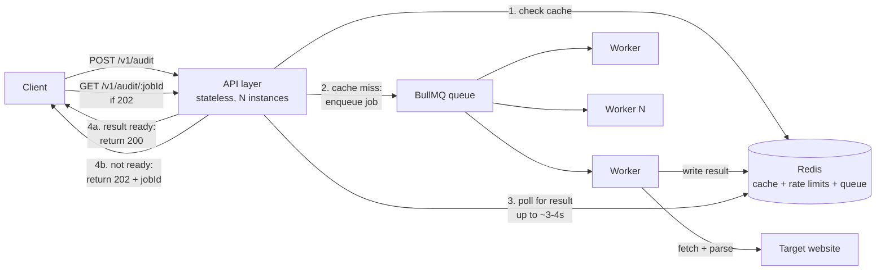

# Page Pulse at Scale — Architecture Document

**Scope:** 10,000 audits/day (~7/min average), bursts of 500 concurrent requests, customer-facing response-time SLA.
**Starting point:** the Task A service — single Node process, in-memory cache, in-memory rate limiter, in-process concurrency limiter.

---

## 1. What breaks first, and why

The Task A design has one process holding all state in memory. That's correct for a demo and wrong at this scale for three concrete reasons:

1. **500 concurrent requests will queue behind `MAX_CONCURRENT_AUDITS=10`.** At 10 in flight and an ~8s timeout ceiling, a burst of 500 could take minutes to drain through one process — you'd breach the SLA before you breach capacity.
2. **In-memory cache and rate limiter only work with exactly one instance.** The obvious fix for #1 — run more instances — silently breaks both: each instance has its own cache (more redundant fetches, not fewer) and its own rate-limit counter (a client can multiply its real quota by the instance count).
3. **A slow or hanging target site can only be waited on synchronously.** The request-response cycle ties up an API-facing connection for as long as the audit takes. At 500 concurrent, that's 500 held-open client connections, which is its own resource pressure independent of the outbound fetch.

The redesign below addresses all three by separating "accept the audit request" from "perform the audit," and by moving shared state out of any single process.

---

## 2. Architecture

### Components

- **API layer (stateless, horizontally scaled)** — validates input, checks cache, either returns a cached result immediately or enqueues an audit job and returns a job handle. Same Express app as Task A, minus in-memory cache/rate-limit/concurrency logic.
- **Redis** — three jobs: shared cache (replaces the in-memory `AuditCache`), shared rate-limit counters (replaces per-process `express-rate-limit`), and the job queue itself (or queue metadata, if using a dedicated queue product).
- **Job queue** — decouples "accepted the request" from "did the work." Recommend **BullMQ** (Redis-backed) for this scale; no need for Kafka/SQS/RabbitMQ overhead at 10k/day.
- **Worker pool (stateless, horizontally scaled independently of the API layer)** — pulls jobs off the queue, does the actual fetch + parse, writes the result to Redis, marks the job complete. This is where `ConcurrencyLimiter` logic moves to — but now it's "N workers × M concurrent audits per worker" instead of one process's ceiling.
- **Result delivery** — for a customer-facing SLA, most callers want a synchronous-feeling response. Recommend: API layer holds the HTTP connection open for a short window (e.g. 3–4s) polling Redis for the result; if the job finishes within that window, return it inline exactly like Task A's response shape. If not, return `202 Accepted` with a `GET /v1/audit/{jobId}` polling endpoint. This gives fast audits (the common case) a synchronous feel with no API change for clients, while slow ones degrade gracefully instead of holding a connection for 8+ seconds.
- **Postgres (or similar)** — audit history/analytics if the business wants it later. Not required for correctness at this scale; noted as a likely near-term addition, not built now (see "what I deliberately didn't build").

### Data flow

### Where state lives

| State | Task A | At scale |
|---|---|---|
| Audit cache | In-process `Map` | Redis, same TTL semantics, shared across all API + worker instances |
| Rate-limit counters | In-process (`express-rate-limit` default store) | Redis (`rate-limit-redis` store) — one counter per client, correct regardless of which instance handles the request |
| Concurrency limit | In-process semaphore | Queue depth + worker pool size — concurrency is now a property of "how many workers × per-worker limit," configured independently of API instance count |
| Job status/result | N/A (synchronous only) | Redis, keyed by job ID, short TTL (results are also written to cache on success) |

---

## 3. Technology decisions and rejected alternatives

**Redis for cache + rate limiting.**
Rejected: keeping cache/rate-limiting in-process with sticky sessions (routing a client to the same instance every time). Sticky sessions solve rate-limiting correctness but not caching efficiency — a URL fetched by client A's instance still isn't shared with client B's instance, so you keep the redundant-fetch problem. Redis is a small piece of infrastructure for a large correctness win, and it's the same store doing double duty (cache + counters), not two systems.

**BullMQ over Kafka/SQS.**
Rejected: Kafka — built for high-throughput event streaming and multi-consumer fan-out; 10k jobs/day (~0.1/sec average, bursty to maybe 10–20/sec) doesn't need it, and it's meaningfully more operational overhead (ZooKeeper/KRaft, partition management) for no benefit at this volume. Rejected: SQS — perfectly reasonable, and if this were deploying to AWS with other SQS-based services already in place I'd pick it for one less piece of self-hosted infra. BullMQ wins here specifically because it's Redis-backed and Redis is already in the stack for cache/rate-limiting — one dependency, not two.

**Hold-connection-then-202-fallback over pure async (always 202).**
Rejected: making every request immediately return 202 + a job ID, full stop. That's simpler to build and reason about, but it forces every client integration to implement polling even though the large majority of audits (fast, small pages) will finish in well under a second. Optimizing for the common case at the API contract level is worth the slightly more complex API-layer logic.

**Horizontal scaling of stateless API + worker tiers over a single bigger machine.**
Rejected: vertical scaling (one large instance). It doesn't address the SLA risk from a single slow target site holding up a worker slot, it's a single point of failure, and it doesn't allow scaling API capacity and audit-processing capacity independently — which matters here because they have different bottlenecks (API is CPU-light/IO-light; workers are IO-bound on slow external sites).

---

## 4. Three most likely failure modes and mitigations

**1. A slow or hanging target site exhausts worker capacity.**
If several audited URLs happen to be slow simultaneously, workers pile up waiting on `fetch`, starving the queue for everyone else. *Mitigation:* the existing per-request timeout (Task A) caps the damage per job, but add a **per-worker concurrency cap** (same semaphore pattern as Task A, just now bounding one worker's fetches, not the whole system) plus **autoscaling on queue depth** — if jobs are queuing faster than they drain, add workers. Circuit-breaker consideration: if a specific hostname fails/times out repeatedly in a short window, short-circuit further audits of that host for a cooldown period instead of letting every job against it hit the full timeout.

**2. Redis becomes a single point of failure.**
Cache, rate limits, and the job queue all live in Redis — if it goes down, the whole system stops, not just degrades. *Mitigation:* run Redis in a managed, replicated configuration (e.g. a managed Redis with automatic failover) rather than a single instance. Design the API layer to **fail open on cache/rate-limit Redis errors** (treat as cache miss / not rate-limited, log loudly) rather than failing the request — losing caching or rate-limiting temporarily is a much smaller problem than a total outage. The job queue itself is harder to fail open on — that needs Redis to be reliably available, which is the actual argument for paying for managed replication rather than trying to build resilience around it.

**3. A burst of 500 concurrent requests all miss cache at once (e.g. a batch import from one customer).**
This is exactly the "500 concurrent" scenario in the brief and, unmitigated, floods the queue and blows every SLA at once. *Mitigation:* the per-client rate limiter (already in Task A, now Redis-backed) is the first line of defense — a single customer sending 500 requests at once should hit their own limit quickly, not exhaust shared capacity. Beyond that, queue-depth-based autoscaling absorbs genuine multi-customer bursts, and the 202-fallback path means the SLA commitment can honestly be "we'll tell you within N seconds whether this is done or still processing" rather than "every request completes synchronously no matter what."

---

## 5. Observability and rollback

**What to monitor and alert on:**

| Signal | Why it matters | Alert threshold (starting point) |
|---|---|---|
| Queue depth / age of oldest unprocessed job | Direct leading indicator of SLA risk — this is what tells you "we're falling behind" before customers notice | Alert if oldest job age exceeds ~half the SLA window |
| P50/P95/P99 audit latency (job accepted → result available) | The actual SLA metric | Alert on P95 approaching the SLA threshold, not just breaches |
| Error rate by error code (`UPSTREAM_TIMEOUT`, `UPSTREAM_UNREACHABLE`, `INTERNAL_ERROR`) | Distinguishes "the internet is having a bad day" (expected, target-side) from "we broke something" (`INTERNAL_ERROR` spiking is always our bug) | Alert on `INTERNAL_ERROR` rate specifically — any sustained rise is actionable |
| Redis availability/latency | Everything depends on it | Alert on connection errors or latency spikes, not just full outage |
| Worker pool utilization | Tells you whether to scale workers up, or whether slowness is target-side, not capacity-side | Alert if sustained >85% for the configured autoscaling window |

**Rolling back a bad deploy:**
API layer and worker layer deploy independently (they're separately scaled tiers), which limits blast radius — a bad worker deploy doesn't take down the API's ability to serve cached results. Use a standard staged rollout (canary a small percentage of instances, watch the error-rate and latency signals above for a fixed bake time, then proceed or auto-rollback). Keep the previous container image/version immediately promotable so rollback is "redeploy the last known-good tag," not a rebuild. Because job state lives in Redis rather than in-process, a rolled-back worker can pick up in-flight jobs left by the bad version without any special reconciliation step — that's a direct benefit of not holding state in the process being replaced.

---

## What I deliberately didn't build

- **Postgres/analytics store** — not needed for correctness at this scale or SLA; flagged as a natural next step once there's an actual reporting requirement, not built speculatively.
- **Multi-region deployment** — nothing in the brief (10k/day, one SLA, no stated geographic requirement) justifies the operational cost yet. Single-region with replicated Redis and horizontally scaled API/worker tiers is the right amount of infrastructure for the stated problem.
